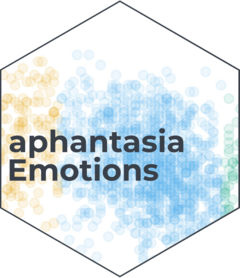
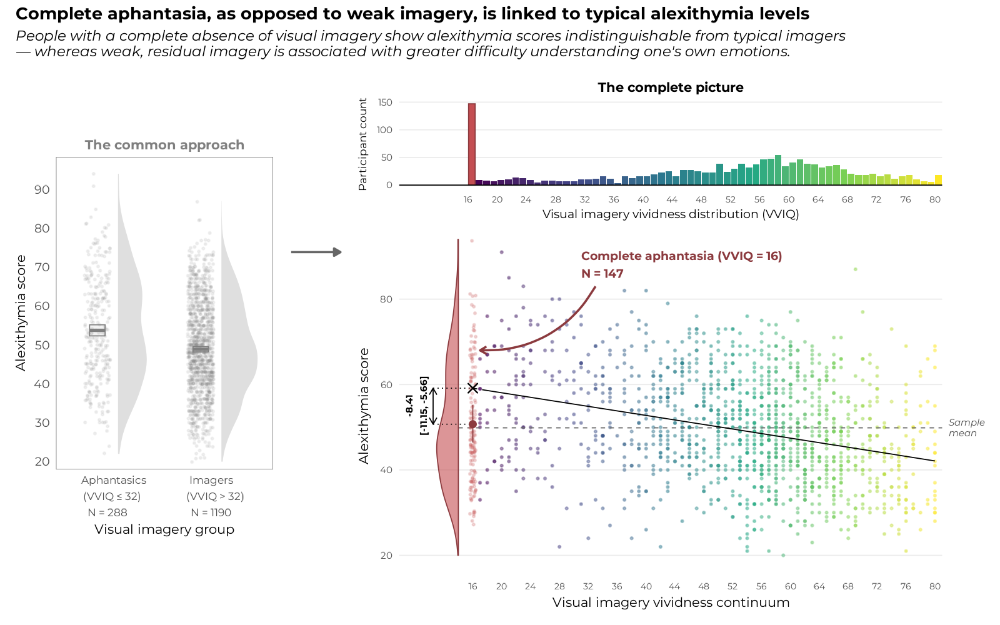

<!-- README.md is generated from README.Rmd. Please edit that file -->

```{r, include = FALSE}
knitr::opts_chunk$set(
  collapse = TRUE,
  comment = "#>",
  fig.path = "man/figures/README-",
  out.width = "100%"
)
```

# aphantasiaEmotions <a href="https://m-delem.github.io/aphantasiaEmotions/"></a>

<!-- badges: start -->

<a href="https://osf.io/b837s/" target="_blank"></a>
<a href="https://m-delem.github.io/aphantasiaEmotions/" target="_blank"></a>
<a href="https://app.codecov.io/gh/m-delem/aphantasiaEmotions" target="_blank"></a>
<a href="https://doi.org/10.31234/osf.io/es425_v1" target="_blank"></a>
<!-- badges: end -->

aphantasiaEmotions is a data analysis project and an *Extended Online 
Report* (see below) wrapped in an R package for reproducibility[^1]. It contains
the code and data to reproduce the analyses presented in the article "*The 
Linear Relationship Between Visual Imagery and Alexithymia Breaks When Imagery 
Is Absent: Complete Aphantasics Are No More Alexithymic Than Typical Imagers *".
You can read the preprint 
<a href="https://doi.org/10.31234/osf.io/es425_v1" target="_blank">here</a>. 
This repository is archived with a permanent DOI on the Open
Science Framework <a href="https://osf.io/b837s/" target="_blank">here</a>.

[^1]: The R package structure was chosen to facilitate the sharing of the code
    and data with the scientific community, and to make it easy to reproduce the
    analyses. It is not intended to be a general-purpose package, but rather a
    collection of functions and data specific to this study (although many
    functions are reusable in their own right). The package development workflow
    (see <a href="https://r-pkgs.org/" target="_blank">this reference book</a>)
    is also a good way to ensure that the code is well-documented and tested,
    which is important for reproducibility in scientific research.

Below is the graphical abstract of this study, which summarises the main finding
that came out of the analyses.

```{r, fig.alt="Graphical abstract for the study.", echo=FALSE}

```

## What exactly is in this R package?

The package includes the raw data used in the analyses in the form of a built-in
dataset called `all_data` to make it easily accessible and reusable. This table
is the combination of two original, previously unpublished datasets, and three
datasets from previous studies, namely @aleAphantasiaAlexithymiaPredict2024,
@monzelAffectiveProcessingAphantasia2024 and @kvammeWhenWeakImagery2026. The
package comes with a set of functions for manipulating the data and reliably
reproducing the analyses presented in the article.

Beyond the article itself, this project's full history and analyses are documented as an
**Extended Online Report (EOR)**: a structure of interlinked, executable pages
that go well beyond what a traditional paper's Methods and Results sections can
show — the reasoning behind each modelling choice, the exploratory work that
didn't make it into the manuscript for space, and the historical process that
produced the finding in the first place. Where the article is a summary, the
EOR is the full account. It is organised as follows:

- [**How this study found its shape**](https://m-delem.github.io/aphantasiaEmotions/articles/how-this-study-found-its-shape.html) — the discovery process, dataset by dataset, told as it actually happened.
- [**Sample description**](https://m-delem.github.io/aphantasiaEmotions/articles/sample-description.html) — a closer look at the five pooled datasets.
- [**Model comparison**](https://m-delem.github.io/aphantasiaEmotions/articles/model-comparison.html) — how a naive threshold, a categorical grouping, and several continuous models were compared, including a direct comparison against @kvammeWhenWeakImagery2026's own published approach.
- [**The floor-group model, in depth**](https://m-delem.github.io/aphantasiaEmotions/articles/floor-group-model.html) — the study's central finding, its statistical evidence, and how it holds up once study-level heterogeneity is accounted for.
- [**For those who come after**](https://m-delem.github.io/aphantasiaEmotions/articles/for-those-who-come-after.html) — promising directions this project didn't have time to pursue fully.

If you'd rather get straight to using the package yourself, the
[**Get Started**](https://m-delem.github.io/aphantasiaEmotions/articles/aphantasiaEmotions.html)
page is a short, practical introduction to the data and the core functions.

The source code of every page above is available in the `vignettes/` folder of
the package repository.

## Installation

You can install the development version of aphantasiaEmotions from
[GitHub](https://github.com/) with:

``` r
# install.packages("pak")
pak::pak("m-delem/aphantasiaEmotions")
```

Alternatively, you can clone the repository, launch the R project in RStudio by
opening the `aphantasiaEmotions.Rproj` file and run the following command:

```{r}
devtools::load_all()
```

... Which will load the package and make all its functions and data available in
your R session.

## Citation

This GitHub repository is archived in the OSF project, which allowed to assign a
permanent DOI to the code and data. Thus, if you use this code or data in your
research, please cite the OSF project with the following:

> Delem, M. (2026). "Supplementary materials for 'Complete Aphantasics Are No More Alexithymic Than Typical Imagers'." https://doi.org/10.17605/OSF.IO/B837S.

## References
