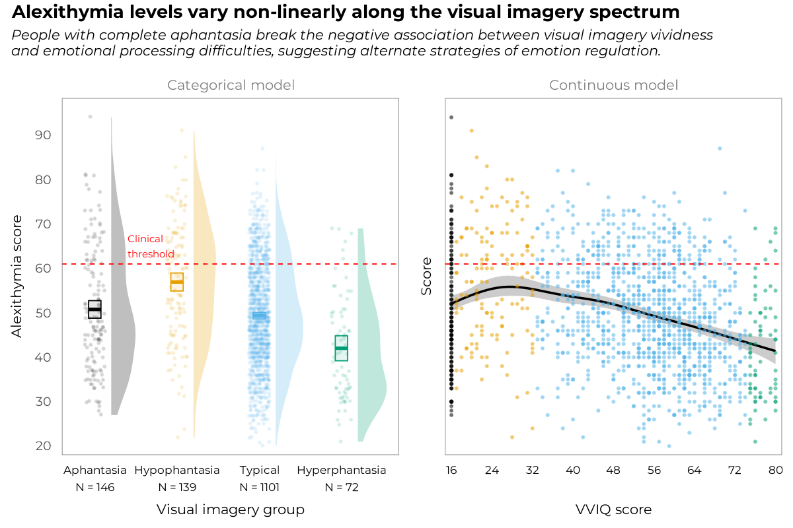

<!-- README.md is generated from README.Rmd. Please edit that file -->

# aphantasiaEmotions

<!-- badges: start -->

<a href="https://osf.io/b837s/" target="_blank"></a>
<a href="https://m-delem.github.io/aphantasiaEmotions/" target="_blank"></a>
<a href="https://app.codecov.io/gh/m-delem/aphantasiaEmotions" target="_blank"></a>

<!-- badges: end -->

aphantasiaEmotions is a data analysis project wrapped in an R package
for reproducibility[^1]. It contains the code and data to reproduce the
analyses presented in the article “*Aphantasics Process Emotions
Differently: Evidence of a Non-linear Relationship Between Visual
Imagery and Emotional Processing Abilities*”. This repository is
archived with a permanent DOI on the Open Science Framework
<a href="https://osf.io/b837s/" target="_blank">here</a>.
<!-- You can read the preprint <a href="https://osf.io/b837s/" target="_blank">here</a>. -->

Below is the graphical abstract of this study, which summarises the main
finding that came out of the analyses.

<figure>

<figcaption aria-hidden="true">Graphical abstract for the
study.</figcaption>
</figure>

## What exactly is in this R package?

The package includes the raw data used in the analyses in the form of a
built-in dataset called `all_data` to make it easily accessible and
reusable. This table is the combination of two original, previously
unpublished datasets, and three datasets from previous studies, namely
Ale & Burns (2024), Monzel et al. (2024) and Kvamme et al. (2025). The
package comes with a set of functions for manipulating the data and
reliably reproducing the analyses presented in the article. The data and
the functions are documented in detail in [the package
website](https://m-delem.github.io/aphantasiaEmotions), which also
contains a vignette with an extended analysis report containing all
analysis outputs, including those not reported in the article for
brevity.

The source code of this vignette is available in the `vignettes/` folder
of the package repository.

## Installation

You can install the development version of aphantasiaEmotions from
[GitHub](https://github.com/) with:

``` r
# install.packages("pak")
pak::pak("m-delem/aphantasiaEmotions")
```

Alternatively, you can clone the repository, launch the R project in
RStudio by opening the `aphantasiaEmotions.Rproj` file and run the
following command:

``` r
devtools::load_all()
#> ℹ Loading aphantasiaEmotions
#> Welcome to aphantasiaEmotions.
```

… Which will load the package and make all its functions and data
available in your R session.

## Citation

This GitHub repository is archived in the OSF project, which allowed to
assign a permanent DOI to the code and data. Thus, if you use this code
or data in your research, please cite the OSF project with the
following:

> Delem M, Ruby P, Plancher G (2025). “Supplementary materials for
> ‘Aphantasics Process Emotions Differently’.”
> <https://doi.org/10.17605/OSF.IO/B837S>.

### References

<div id="refs" class="references csl-bib-body hanging-indent"
entry-spacing="0" line-spacing="2">

<div id="ref-aleAphantasiaAlexithymiaPredict2024" class="csl-entry">

Ale, E., & Burns, E. (2024, March 5). *Aphantasia and alexithymia
predict complex PTSD symptoms*. <https://doi.org/10.31234/osf.io/kj5d3>

</div>

<div id="ref-kvammeWhenWeakImagery2025" class="csl-entry">

Kvamme, T., Monzel, M., Nagai, Y., & Silvanto, J. (2025, February 13).
*When Weak Imagery is Worse Than None: Core Aphantasia and Hypophantasia
Relate Differently to Mental Health, Mediated by Subjective
Interoception and Alexithymia* (6fhj4_v1).
<https://doi.org/10.31234/osf.io/6fhj4_v1>

</div>

<div id="ref-monzelAffectiveProcessingAphantasia2024" class="csl-entry">

Monzel, M., Karneboge, J., & Reuter, M. (2024). Affective processing in
aphantasia and potential overlaps with alexithymia: Mental imagery
facilitates the recognition of emotions in oneself and others.
*Biomarkers in Neuropsychiatry*, *11*, 100106.
<https://doi.org/10.1016/j.bionps.2024.100106>

</div>

</div>

[^1]: The R package structure was chosen to facilitate the sharing of
    the code and data with the scientific community, and to make it easy
    to reproduce the analyses. It is not intended to be a
    general-purpose package, but rather a collection of functions and
    data specific to this study (although many functions are reusable in
    their own right). The package development workflow (see
    <a href="https://r-pkgs.org/" target="_blank">this reference
    book</a>) is also a good way to ensure that the code is
    well-documented and tested, which is important for reproducibility
    in scientific research.
